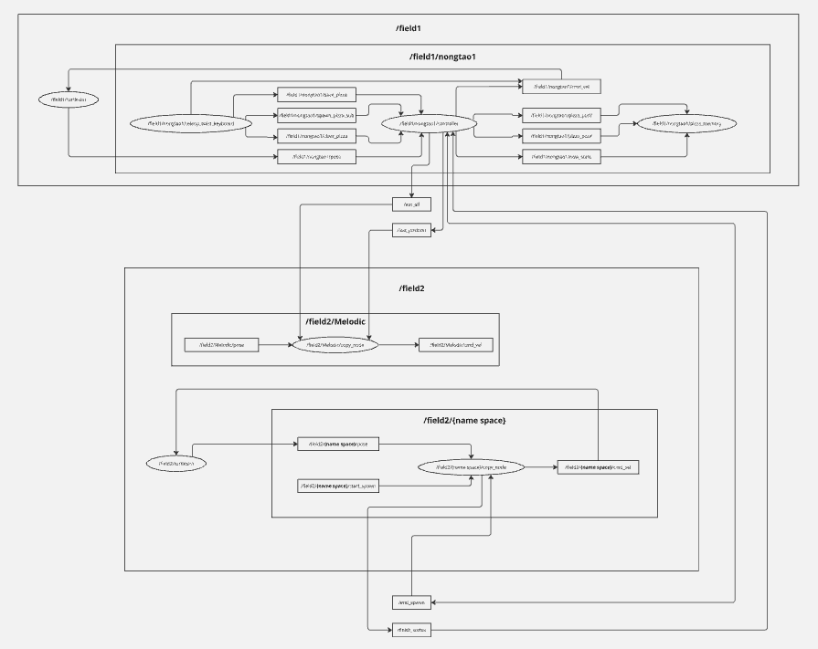

# FRA501 EXAM 6531 6562

## Information
1. Architecture

    1.1.taohunza package :
    
    This package have 2 main package name teleop_twist_keyboard and turtlesim_plus.
   
    The teleop_twist_keyboard package use for recieve input from you keyboard.

    The turtlesim_plus package use for interface and spawn turtle.

    This package have 4 Node :

        copy_turtle_node : This node for control copy turtle.
   
        pizza_memory_node : This node for collect position data of pizza from turtle. 

        turtle_teleop_node : This node for control turtle.

        Melodic_turtle_node : This node for control Melodic turtle.


## How to run

### 1. Setup the Environment
1. Download workspace:
    ```sh
    
    ```
2. Navigate to the project directory :
    ```sh
    cd EXAM1_WS
    ```
3. Install pynput :
    ```sh
    pip install pynput
    ```
### 2. Build the Firmware
1. Build :
    ```sh
    colon build
    ``` 
2. Source workspace :
    ```sh
    source ~/EXAM1_WS/install/setup.bash 
    ```
### 3. Run
1. Source
    ```sh
    source ~/EXAM1_WS/install/setup.bash 
    ```
2. Run teleop_twist_keyboard with namespace :
    ```sh
    ros2 run teleop_twist_keyboard teleop_twist_keyboard --ros-args -r __ns:=/field1/nongtao1
    ```

3. Run launch file :
   ```sh
   ros2 launch taohunza turtle_launch.py
   ```
4. Run rqt :
   ```sh
   rqt
   ```
3. Tune gain
   -Tune kp / kp_angular in rqt


## How to Use

1. Use keyboard for control turtle
2. Use keyboard for spawn / clear / save a Pizza
3. Use rqt to config parameter of gain and pizza amount
   ```sh
   ros2 run rqt_reconfigure rqt_reconfigure
   ```
    (field1-->nongtao1-->controller)
   
   For adjust Pizza amount and Controller gain.

## How to Fix when Bug
1. If it cannot run teleop_twist_keyboard :
   
    1.1. Restart your terminal
   
    2.2. Rebuild & source
    ```sh
    colon build
    source install/setup.bash
    ```
2. Something else :
   
   2.1. Kill all node
   
   2.2. Restart your computer
   
   2.3. Ask chatGPT and let's fix it

   


